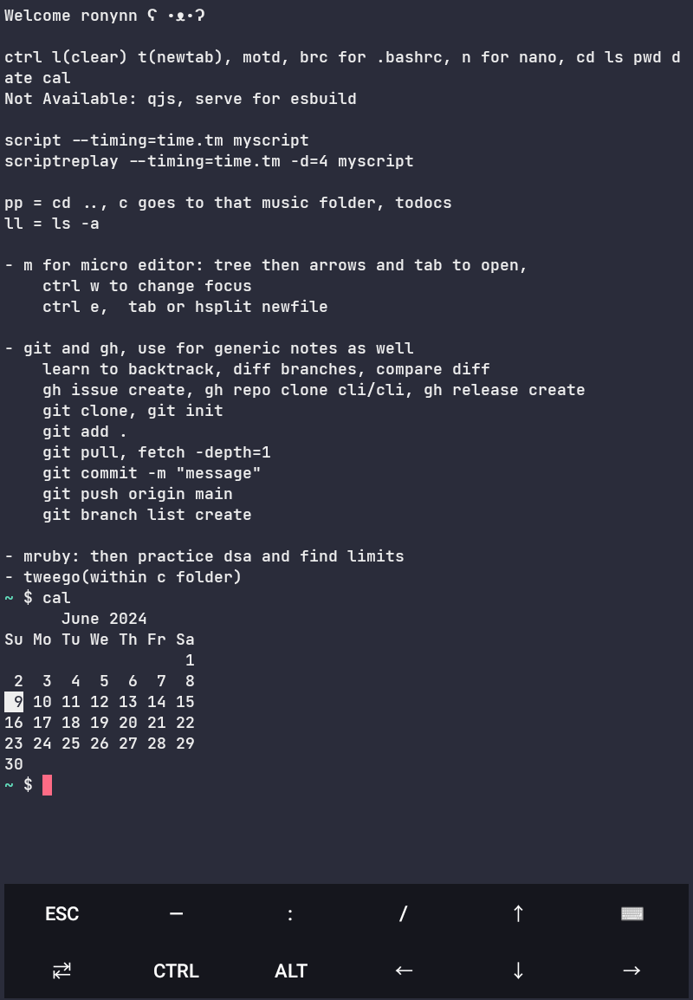

# Dotfiles for Termux Setup

Welcome to my dotfiles repository for setting up Termux to program in Ruby and Tweego, along with some nanorc files and custom Termux properties. This setup is designed to enhance your Termux experience and streamline your programming setup workflow.

## Features
- **Ruby Programming Environment**: Configure Termux for Ruby programming with essential tools and settings.
- **Tweego Setup**: Includes configurations for Tweego, a tool for creating interactive fiction using the Twee markup language.
- **Nanorc Files**: Customized nanorc files for improved syntax highlighting and editing experience.
- **Termux Properties**: Copy of custom Termux properties for personalized settings.
- **Screenshot**: A screenshot showcasing the setup for quick reference.

## Installation
1. Clone this repository to your Termux home directory:
   ```bash
   git clone https://github.com/ronynn/dotfiles.git ~/.dotfiles
   ```

2. Run the setup script to apply configurations:
   ```bash
   cd ~/.dotfiles
   ./setup.sh
   ```

3. Follow any on-screen instructions to complete the setup process.

## Usage
- **Ruby Programming**: Start coding in Ruby by launching the configured environment.
- **Tweego Development**: Create interactive fiction projects using Tweego with the provided settings.
- **Nanorc Files**: Enjoy improved syntax highlighting in the nano text editor.
- **Custom Termux Properties**: Experience a personalized Termux interface with the copied properties.

## Screenshots


## Support
For any issues or feedback, please open an [issue](https://github.com/ronynn/dotfiles/issues) on this repository.

Happy coding! 🚀